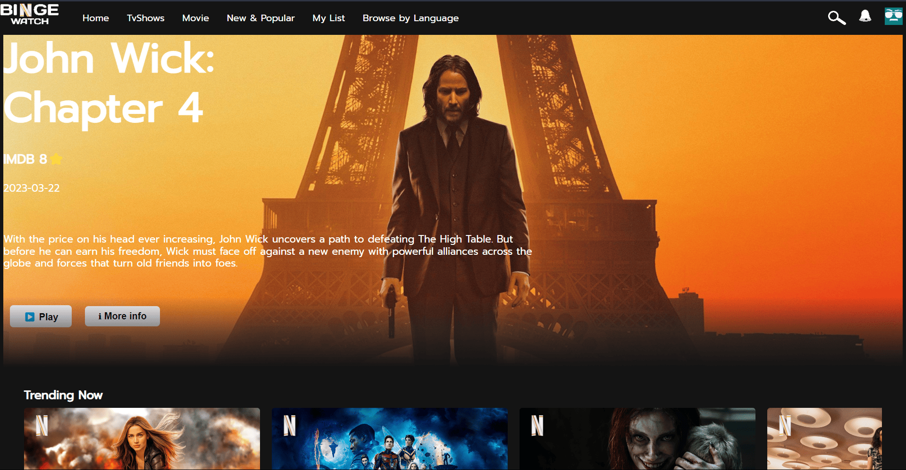
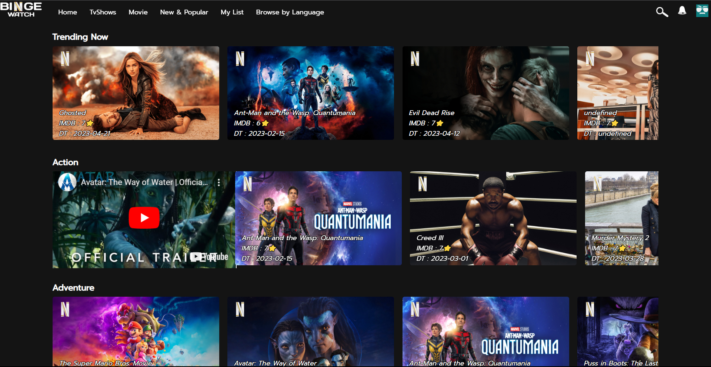

Hi everyone,

I'm excited to share my latest project with all of you! It's a Netflix-like frontend clone called "BingeWatch." You can check it out by following this link: https://phaneendra73.github.io/BingeWatch/.

I built this project using HTML, CSS, and JavaScript, and I'm really happy with how it turned out. "BingeWatch" has a clean and modern design, just like Netflix, and features a similar layout that lets you browse movies and TV shows by genre, search for specific titles, and save your favorites to your watchlist.

As a big fan of Netflix, I had a lot of fun creating this clone and learning more about frontend web development. I hope you'll enjoy using "BingeWatch" as much as I enjoyed building it!

I have used the real time data API from the site called TMDB just like IMDB and it can play movie trailer video on clicking on it using the youtube API.

Please feel free to check it out and let me know what you think. If you have any feedback or questions, I'd love to hear from you. Thanks for your support!

